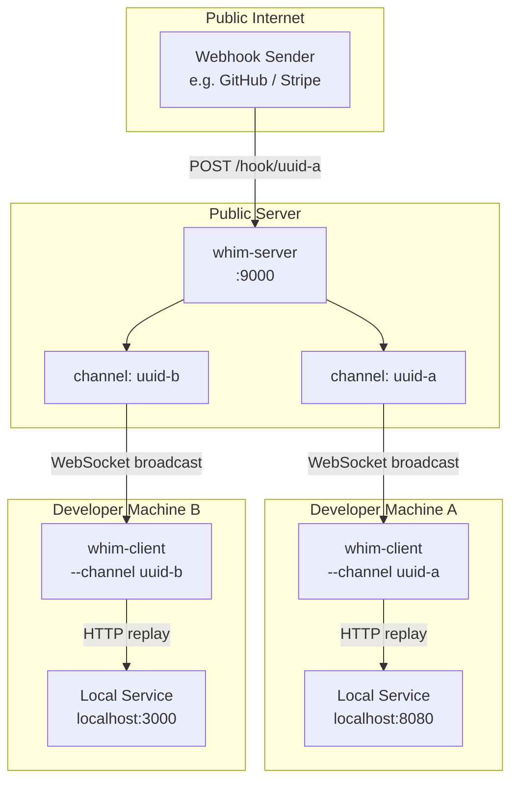
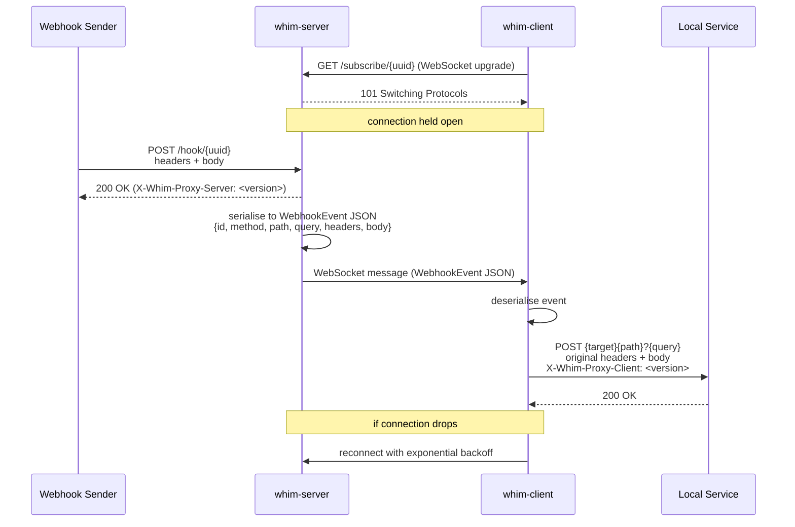

<h1>whim-proxy </h1>

[](https://github.com/kakwa/whim-proxy/actions/workflows/ci.yml)
[](https://codecov.io/gh/kakwa/whim-proxy)

Whim-proxy (WebHook In the Middle Proxy) is a lightweight webhook proxy designed to help developers test webhook consumer development.

Frequently, webhook event senders cannot be integrated with a private/NATed developer laptop, either because it's too complex, or part of a third-party service like GitHub or Stripe.

Whim-proxy solves this issue with a `whim-server` & `whim-client` working as follows:

1. a public/reachable webhook listener (`whim-server`) receiving the events.
2. Each event is then forwarded to subscribed `whim-client` running on developer laptops using websocket reverse tunnels.
3. Finally the `whim-client` takes the event, and reproduces the original webhook, targeting the local consumer instance being developed.

## Quick start

```bash
# Build both binaries
make build

# 1. Start the proxy server on a public host (listens on :9000 by default)
./bin/whim-server

# 2. Generate a channel UUID
CHANNEL=$(./bin/whim-client --gen-uuid)

# 3. Start a client on your laptop
./bin/whim-client --server ws://<public-host>:9000 --channel "$CHANNEL" --target http://localhost:8080

# 4. Configure your webhook sender to POST to that channel:
curl -X POST http://<public-host>:9000/hook/"$CHANNEL" \
     -H "Content-Type: application/json" \
     -d '{"event":"ping"}'
```

The client replays the request to `http://localhost:8080` with the original
method, path, query string, headers, and body intact. It reconnects
automatically with exponential backoff if the server drops.

## Flags

### Server (`whim-server`)

| Flag             | Default   | Description                                                   |
|------------------|-----------|---------------------------------------------------------------|
| `--addr`         | `:9000`   | TCP listen address                                            |
| `--log-level`    | `info`    | Log verbosity: `debug`, `info`, `warn`, `error`               |
| `--json`         | `false`   | Emit logs as JSON (default: console)                          |
| `--backlog-size` | `10000`   | Max events kept globally in the in-memory store               |
| `--redis-url`    |           | Redis URL (`redis://...`) — enables Redis store               |
| `--redis-ttl`    | `24h`     | TTL applied to each Redis channel key after its last write    |

### Client (`whim-client`)

| Flag          | Default                 | Description                                      |
|---------------|-------------------------|--------------------------------------------------|
| `--server`    | `ws://localhost:9000`   | WebSocket server base URL                        |
| `--channel`   | *(required)*            | Channel UUID to subscribe to                     |
| `--target`    | `http://localhost:8080` | Local HTTP service to forward events to          |
| `--log-level` | `info`                  | Log verbosity: `debug`, `info`, `warn`, `error`  |
| `--json`      | `false`                 | Emit logs as JSON (default: console)             |
| `--gen-uuid`  |                         | Print a new UUID to stdout and exit              |

> **Channel names must be valid UUIDs.** The server rejects hook and subscribe
> requests with a `400` if the channel is not a well-formed UUID v4.

## API

| Method | Path                   | Description                                      |
|--------|------------------------|--------------------------------------------------|
| `*`    | `/hook/{uuid}`         | Receive a webhook and broadcast it to subscribers |
| `GET`  | `/subscribe/{uuid}`    | WebSocket — subscribe to a channel               |
| `GET`  | `/logs/{uuid}`         | Return the last 10 events received on a channel  |

The `/logs/{uuid}` response is a JSON array of `WebhookEvent` objects in
chronological order (oldest first). Returns an empty array if no events have
been received yet.

```bash
curl http://<public-host>:9000/logs/<channel-uuid>
```

### Event store

By default events are kept in a global in-memory ring buffer (`--backlog-size`,
default 10 000). When the buffer is full, the oldest event across all channels
is silently evicted.

For persistence across restarts, pass `--redis-url`:

```bash
./bin/whim-server --redis-url redis://localhost:6379 --redis-ttl 48h
```

With Redis, each channel is stored as a list keyed `whim:logs:{uuid}`. The
`--backlog-size` cap applies per channel, and `--redis-ttl` resets on every
new event so the key expires only after a period of inactivity.

## Logging

Both binaries use structured [zap](https://github.com/uber-go/zap) logging.

By default logs are human-readable console output. Pass `--json` to switch to
newline-delimited JSON, suitable for log aggregators (Loki, CloudWatch, etc.):

```bash
./bin/whim-server --json --log-level debug
```

At `debug` level the server also logs the full decoded webhook payload for each
event that has at least one subscriber.

## Version headers

Every response from `whim-server` includes an `X-Whim-Proxy-Server` header
with the server version. Every request replayed by `whim-client` to the local
target includes an `X-Whim-Proxy-Client` header, so your local service can
distinguish proxied traffic from direct calls.

## Architecture



## Sequence



## How it works

1. The server receives HTTP requests at `/hook/{uuid}` and rejects non-UUID channel names with `400`.
2. It serialises the full request (method, path, query, headers, body) into a `WebhookEvent` JSON message.
3. All WebSocket clients subscribed to that channel receive the message simultaneously.
4. Each client re-issues the request verbatim to its configured `--target`, appending an `X-Whim-Proxy-Client` header.
5. The client auto-reconnects with exponential backoff (1 s → 60 s) if the server drops.

## Building

```bash
make build     # cross-compile client for all platforms, embed in server, build local client
make test      # run tests with race detector
make coverage  # generate coverage.html
make clean     # remove bin/ and embedded client binaries
```

`make build` cross-compiles `whim-client` for Linux, macOS, and Windows (both
`amd64` and `arm64`), places the binaries in `internal/web/clients/`, then
compiles the server — which embeds them via `//go:embed`. The running server
serves them for download at `/clients/{filename}` and lists them on the home
page (`/`).

Running `go build ./cmd/server` directly (without `make`) produces a valid
server binary that works fully, but without the embedded client binaries —
the home page will show a link to GitHub Releases instead.

The version string is embedded at build time from the nearest git tag
(`git describe --tags --always --dirty`) and surfaced in the
`X-Whim-Proxy-Server` / `X-Whim-Proxy-Client` headers.
