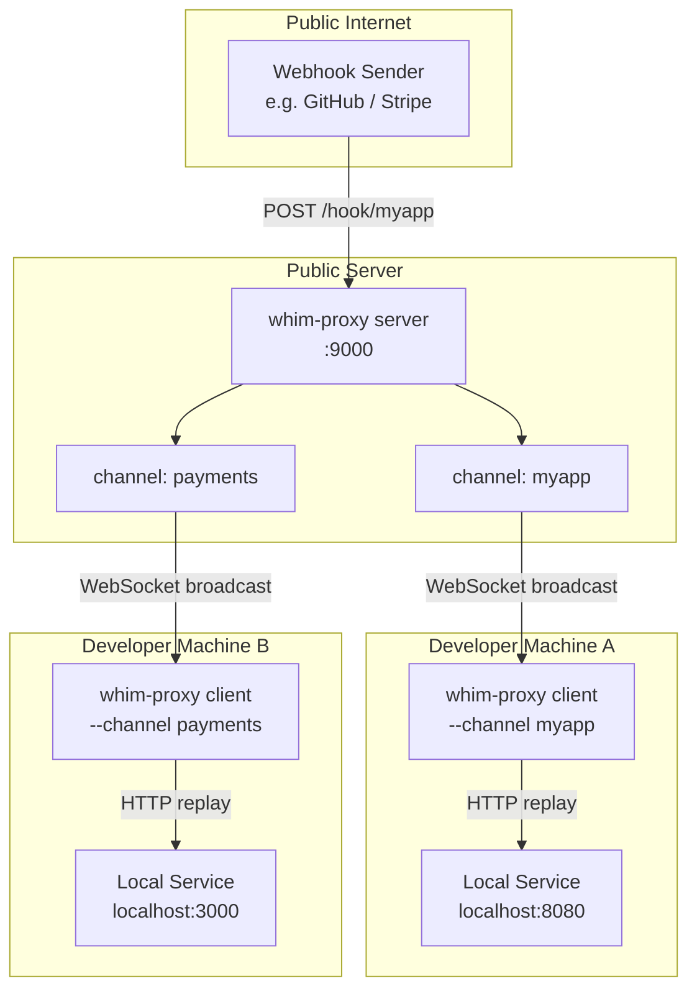
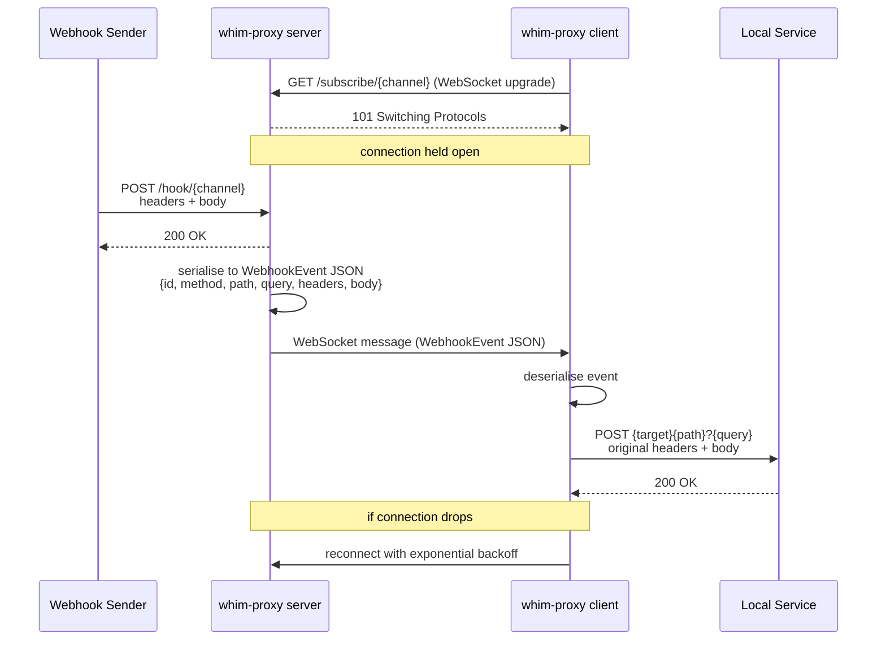

# whim-proxy

[](https://github.com/kakwa/whim-proxy/actions/workflows/ci.yml)
[](https://codecov.io/gh/kakwa/whim-proxy)

A lightweight webhook proxy with a publish/subscribe architecture. Send webhooks
to the **server**; one or more **clients** receive and replay them against a
local HTTP target. Ideal for exposing a local service to external webhook
senders without a full tunnel.

## Quick start

```bash
# 1. Start the proxy server (listens on :9000 by default)
go run ./cmd/server --addr :9000

# 2. Start a client that subscribes to "myapp" and forwards to localhost:8080
go run ./cmd/client --server ws://localhost:9000 --channel myapp --target http://localhost:8080

# 3. Send a test webhook
curl -X POST http://localhost:9000/hook/myapp \
     -H "Content-Type: application/json" \
     -d '{"event":"ping"}'
```

The client will replay the request to `http://localhost:8080/hook/myapp` with
the original method, path, query string, headers, and body intact.

## Flags

### Server

| Flag     | Default  | Description          |
|----------|----------|----------------------|
| `--addr` | `:9000`  | TCP listen address   |

### Client

| Flag        | Default                  | Description                            |
|-------------|--------------------------|----------------------------------------|
| `--server`  | `ws://localhost:9000`    | WebSocket server base URL              |
| `--channel` | *(required)*             | Channel name to subscribe to           |
| `--target`  | `http://localhost:8080`  | Local HTTP service to forward events to |

## Architecture



## Sequence



## How it works

1. The server receives HTTP POST requests at `/hook/{channel}`.
2. It serialises the full request (method, path, query, headers, body) into a
   `WebhookEvent` JSON message.
3. All WebSocket clients subscribed to that channel receive the message.
4. Each client re-issues the request verbatim to its configured `--target`.
5. The client auto-reconnects with exponential backoff if the server drops.

## Building

```bash
go build ./...
# Produces: cmd/server and cmd/client binaries
```
