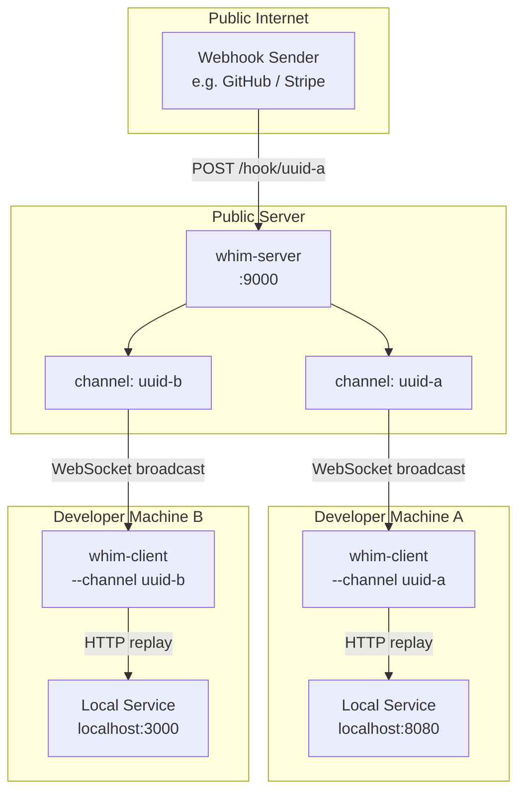
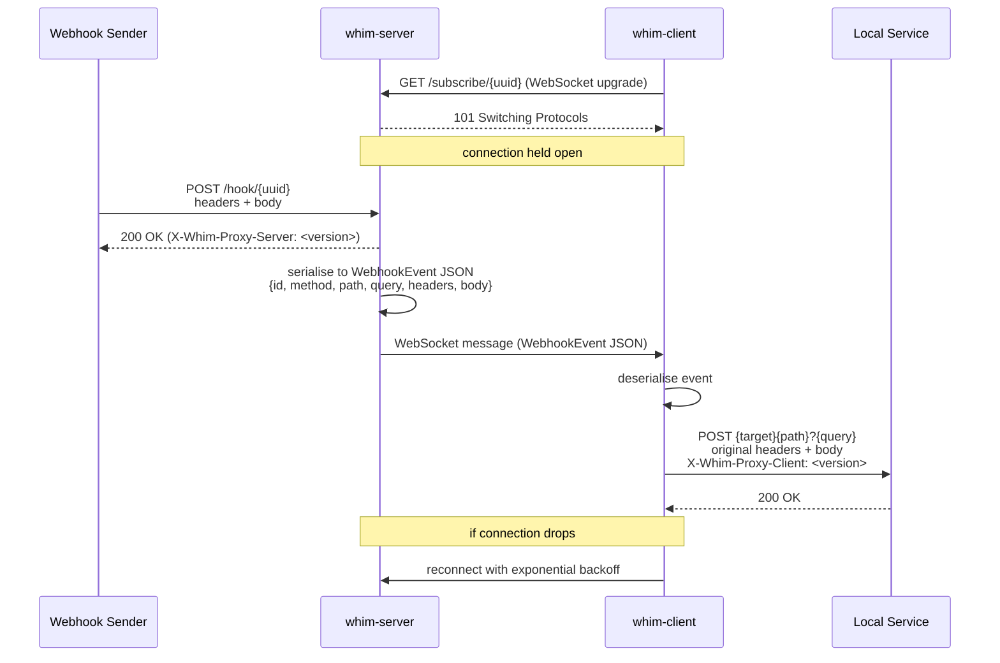

# whim-proxy

[](https://github.com/kakwa/whim-proxy/actions/workflows/ci.yml)
[](https://codecov.io/gh/kakwa/whim-proxy)

Whim-proxy (WebHook In the Middle Proxy) is a lightweight webhook proxy server+client combo designed to help developers test their local webhook consumer development against the real thing when instantiating the webhook producer locally is not an option.

It works by having a public/reachable webhook listener (`whim-server`) receiving the events.

Each event is then forwarded to subscribed `whim-client` running on developer laptops using websocket reverse tunnels.

Finally the `whim-client` takes the event, and reproduces the query onto the local webhook consumer being developed.

## Quick start

```bash
# Build both binaries
make build

# 1. Start the proxy server on a public host (listens on :9000 by default)
./bin/whim-server

# 2. Start a client on your laptop — omit --channel to auto-generate a UUID
./bin/whim-client --server ws://<public-host>:9000 --target http://localhost:8080

# The client logs the channel UUID it is subscribed to, e.g.:
#   INFO  generated channel UUID  {"channel": "4b1a2c3d-..."}
#
# 3. Configure your webhook sender to POST to that channel:
curl -X POST http://<public-host>:9000/hook/4b1a2c3d-... \
     -H "Content-Type: application/json" \
     -d '{"event":"ping"}'
```

The client replays the request to `http://localhost:8080` with the original
method, path, query string, headers, and body intact. It reconnects
automatically with exponential backoff if the server drops.

## Flags

### Server (`whim-server`)

| Flag          | Default   | Description                               |
|---------------|-----------|-------------------------------------------|
| `--addr`      | `:9000`   | TCP listen address                        |
| `--log-level` | `info`    | Log verbosity: `debug`, `info`, `warn`, `error` |
| `--json`      | `false`   | Emit logs as JSON (default: console)      |

### Client (`whim-client`)

| Flag          | Default                 | Description                                      |
|---------------|-------------------------|--------------------------------------------------|
| `--server`    | `ws://localhost:9000`   | WebSocket server base URL                        |
| `--channel`   | *(auto-generated UUID)* | Channel UUID to subscribe to                     |
| `--target`    | `http://localhost:8080` | Local HTTP service to forward events to          |
| `--log-level` | `info`                  | Log verbosity: `debug`, `info`, `warn`, `error`  |
| `--json`      | `false`                 | Emit logs as JSON (default: console)             |

> **Channel names must be valid UUIDs.** The server rejects hook and subscribe
> requests with a `400` if the channel is not a well-formed UUID v4.

## Logging

Both binaries use structured [zap](https://github.com/uber-go/zap) logging.

By default logs are human-readable console output. Pass `--json` to switch to
newline-delimited JSON, suitable for log aggregators (Loki, CloudWatch, etc.):

```bash
./bin/whim-server --json --log-level debug
```

At `debug` level the server also logs the full decoded webhook payload for each
event that has at least one subscriber.

## Version headers

Every response from `whim-server` includes an `X-Whim-Proxy-Server` header
with the server version. Every request replayed by `whim-client` to the local
target includes an `X-Whim-Proxy-Client` header, so your local service can
distinguish proxied traffic from direct calls.

## Architecture



## Sequence



## How it works

1. The server receives HTTP requests at `/hook/{uuid}` and rejects non-UUID channel names with `400`.
2. It serialises the full request (method, path, query, headers, body) into a `WebhookEvent` JSON message.
3. All WebSocket clients subscribed to that channel receive the message simultaneously.
4. Each client re-issues the request verbatim to its configured `--target`, appending an `X-Whim-Proxy-Client` header.
5. The client auto-reconnects with exponential backoff (1 s → 60 s) if the server drops.

## Building

```bash
make build     # compile both binaries to bin/
make test      # run tests with race detector
make coverage  # generate coverage.html
make clean     # remove bin/
```

The version string is embedded at build time from the nearest git tag
(`git describe --tags --always --dirty`) and surfaced in the
`X-Whim-Proxy-Server` / `X-Whim-Proxy-Client` headers.
