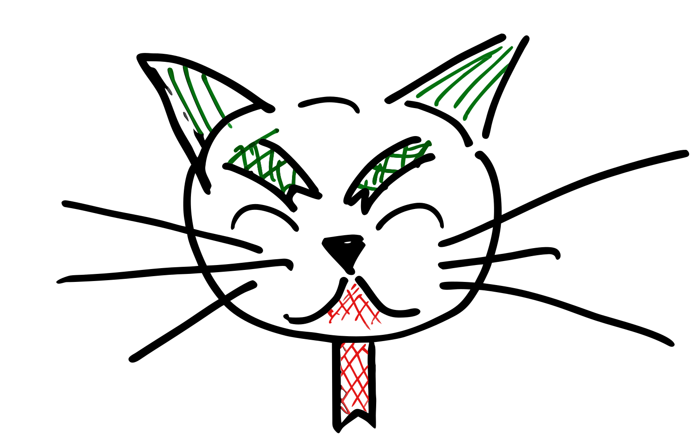
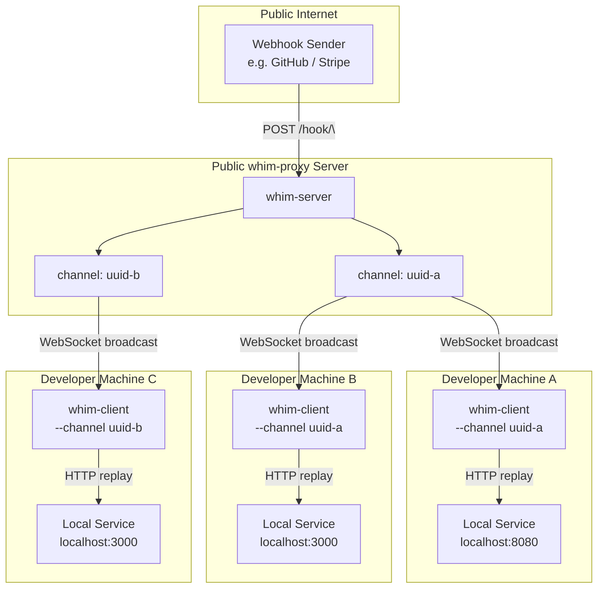
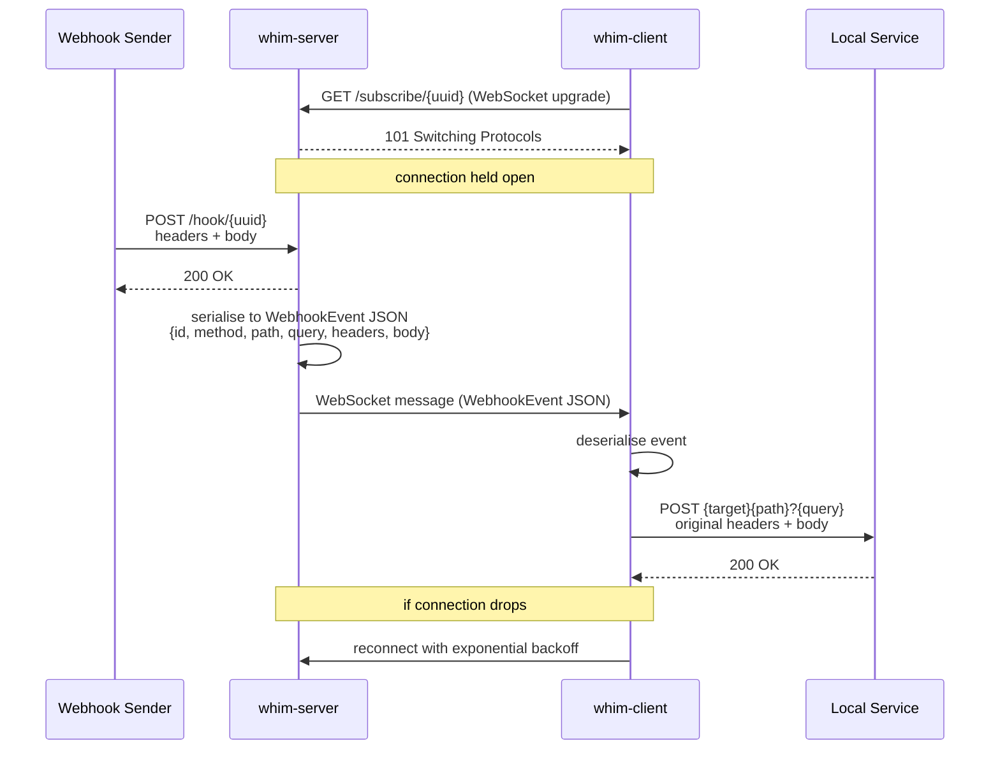

<p align="center">
  
</p>
<h1 align="center">Webhook In The Middle Proxy</h1>

[](https://github.com/kakwa/whim-proxy/actions/workflows/ci.yml)
[](https://codecov.io/gh/kakwa/whim-proxy)

Whim-proxy (WebHook In the Middle Proxy) is a lightweight tool designed to help developers implement webhook consumers.

Webhook producers often can't reach NATed/firewalled developer machines nor could they be run locally (e.g. third-party like GitHub or Stripe).

Whim-proxy solves this issue with a `whim-server` & `whim-client` combo working as follows:

1. A public/reachable webhook listener on `whim-server` receives the events from producers.
2. Each event is then forwarded to subscribed `whim-client` processes running on developer's laptop via WebSocket reverse-tunnels.
3. Finally, the `whim-client` takes the event, and reproduces the original webhook, targeting the local consumer being developed/tested.

## Public instance

A public instance is available at [https://whim-proxy.kakwalab.dev/](https://whim-proxy.kakwalab.dev/) if you don't want to deploy your own server.

Download the client from the page, open a channel, and point your webhook sender at it.

Don't send sensitive data, cats cannot be trusted after all.

## Quick start

```bash
# Build client and server binaries
git clone https://github.com/kakwa/whim-proxy && cd whim-proxy
make build

# Set a server listen address
WHIM_SERVER=localhost:9000

# Generate a channel uuid (can be reused accross sessions)
CHANNEL=$(./bin/whim-client --gen-uuid)

# Set the target Webhook url of your local event consumer
TARGET=http://localhost:8080/webhook


# 1. Start the proxy server on a public host (listens on :9000 by default)
./bin/whim-server -addr $WHIM_SERVER --log-level debug

# 2. Start a client on your laptop (switch protos to wss:// and https:// if TLS)
./bin/whim-client --server ws://$WHIM_SERVER \
    --log-level debug \
    --channel "$CHANNEL" \
    --target "$TARGET"

# 3. POST test webhook to channel:
curl -X POST "http://$WHIM_SERVER/hook/$CHANNEL" \
     -H "Content-Type: application/json" \
     -d '{"event":"ping"}'
```

> **Channel names must be valid UUIDs.** The server rejects hook and subscribe
> requests with a `400` if the channel is not a well-formed UUID v4.

> Treat the channel UUID somewhat as a secret.
> If the channel UUID is known, eavesdroppers could easily subscribe to your events. 


## Flags

### Server (`whim-server`)

| Flag                  | Default  | Description                                                  |
|-----------------------|----------|--------------------------------------------------------------|
| `--addr`              | `:9000`  | TCP listen address                                           |
| `--log-level`         | `info`   | Log verbosity: `debug`, `info`, `warn`, `error`              |
| `--json`              | `false`  | Emit logs as JSON (default: console)                         |
| `--backlog-size`      | `10000`  | Max events kept globally in the in-memory store              |
| `--redis-url`         |          | Redis URL (`redis://...`) — enables Redis store              |
| `--redis-ttl`         | `24h`    | TTL applied to each Redis channel key after its last write   |
| `--max-channels`      | `100000` | Max distinct channels tracked (0 = unlimited)                |
| `--max-clients`       | `100`    | Max WebSocket subscribers per channel (0 = unlimited)        |
| `--max-clients-per-ip`| `1000`   | Max WebSocket subscribers per source IP (0 = unlimited)      |

### Client (`whim-client`)

| Flag          | Default                 | Description                                      |
|---------------|-------------------------|--------------------------------------------------|
| `--server`    | `ws://localhost:9000`   | WebSocket server base URL                        |
| `--channel`   | *(required)*            | Channel UUID to subscribe to                     |
| `--target`    | `http://localhost:8080` | Local HTTP service to forward events to          |
| `--log-level` | `info`                  | Log verbosity: `debug`, `info`, `warn`, `error`  |
| `--json`      | `false`                 | Emit logs as JSON (default: console)             |
| `--gen-uuid`  |                         | Print a new UUID to stdout and exit              |

## API


| Method | Path                  | Description                                       |
|--------|-----------------------|---------------------------------------------------|
| `*`    | `/hook/{uuid}`        | Receive a webhook and broadcast it to subscribers |
| `GET`  | `/subscribe/{uuid}`   | WebSocket — subscribe to a channel                |
| `GET`  | `/logs/{uuid}`        | Return the last 10 events received on a channel   |

### Event store

By default events and logs are kept in a local in-memory ring buffer with a set capacity.

For persistence across restarts and/or in a load balanced/HA setup, using Redis is recommended.

To do so, pass `--redis-url` and optionally, the set retention with `--redis-ttl`:

```bash
./bin/whim-server --redis-url redis://localhost:6379 --redis-ttl 48h
```

With Redis, each channel is stored as a list keyed `whim:logs:{uuid}`. The
`--backlog-size` cap applies per channel, and `--redis-ttl` resets on every
new event so the key expires only after a period of inactivity.

## Logging

Both client & server use structured [zap](https://github.com/uber-go/zap) logging.

By default logs are human-readable console output.

Pass `--json` to switch to JSON-formatted logs.

At `debug` level, the server also logs the full decoded webhook payload for each
event that has at least one subscriber.


```bash
./bin/whim-server --json --log-level debug
```

## Version headers

`whim-client` and `whim-server` versions are self-reported through
`X-Whim-Proxy-Client` and `X-Whim-Proxy-Server` http headers respectively.

## Architecture



## Sequence



## Developing

```bash
make build     # cross-compile client for all platforms, embed in server, build local client
make test      # run tests with race detector
make coverage  # generate coverage.html
make clean     # remove bin/ and embedded client binaries
```
